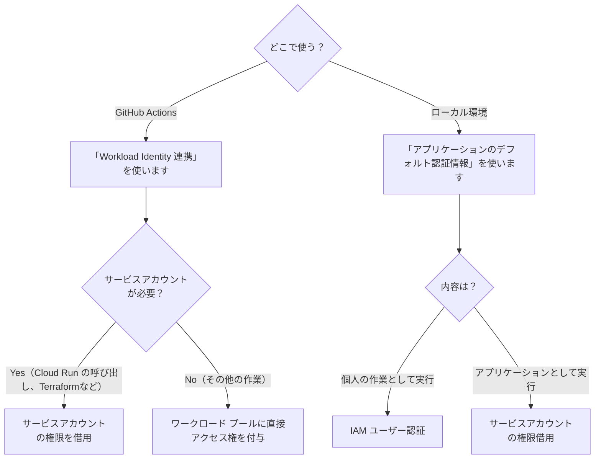

## サービスアカウントキーの危険性

弊社では Google Cloud のサービスを利用して開発を行っています。

各サービスへの操作権限が必要な際、これまで社内ではサービスアカウントキーを発行し、それを個人のローカル環境や GitHub のリポジトリシークレットに保存して使用していました。
しかしサービスアカウントキーを用いた認証方法は、セキュリティ上の問題があります。
期限を定めないキーを発行するということは、一度流用すると一生使い続けられてしまいます。しかも使用ログから利用者を特定することもできません。
かといって一定期間で無効にしてキーを作り直すのは面倒ですし、必要なときに期限が切れていてワークフローが動かないとそれはそれで困ります。

そこで、キーを使わないより安全な認証方法に変えていきます。


_サービスアカウントキーの画面に行くと警告が出る。_

## こんなときに使う

- GitHub Actions から、Google Cloud のサービスの権限が必要な処理をしたいとき
- ローカル環境での開発時、Google Cloud のサービスの権限が必要な処理をしたいとき

## 基本的な方針

- GitHub Actions では、その場限りのトークンを発行する
- ローカル環境では、各個人のアカウントに権限を付与する

これにより、GitHub Actions のワークフローで使用されたトークンが流出しても使おうとしたときには権限がないので、流出したトークンは使えないようになります。
また、各個人のアカウントに権限を付与することで、万が一不正なアクセスがあったとしても使用者を特定できますし、退職者などもう使うことのないユーザーの権限はアカウント自体を停止させることで、利用できなくなります。

## 認証方法の選び方フローチャート

Google Cloud への認証が必要な状況によって利用する方法が異なります。計 4 パターンの認証方法があり、詳細は以降で説明します。



## GitHub Actions（Workload Identity 連携）

GtiHub Actions からの実行の場合、**Workload Identity 連携** という仕組みを使って認証することで、その場限りのトークンを発行することができます。

この仕組みを使う場合、以下の 2 つの方法があります。

1. Direct Workload Identity Federation（推奨）
2. サービスアカウントの権限を借用

基本的には Direct Workload Identity Federation を使うことが望ましいです。
ただし、一部の操作ではサービスアカウントが必要なケースがあるため、その場合はサービスアカウントの権限借用を行います。

### Workload Identity 連携の設定手順

この手順は以下の記事を参考にしています。

https://paper2.hatenablog.com/entry/2024/06/29/143947

#### 1. Workload Identity プールを作成

コンソール：
「IAM と管理」→「Workload Identity プール」から新しいプールを作成します。
複数のリポジトリで使用する場合でも、一つのプールを作成すれば OK です。


Terraform の場合：

```tf
resource "google_iam_workload_identity_pool" "github-actions" {
  description               = "各リポジトリの GitHub Actions から実行する際に使用"
  disabled                  = false
  display_name              = "github-actions"
  project                   = var.project_id
  workload_identity_pool_id = "github-actions"
}
```

#### 2. プロバイダを作成

続いて、プール内にプロバイダを追加します。
こちらも、複数リポジトリで使うとしても一つのプロバイダを作成すれば OK です。

GitHub Actions で使用するため、「発行元」には `https://token.actions.githubusercontent.com` を指定します。


「プロバイダの属性」の設定で、GitHub からやってきた属性を Google Cloud 側で使えるようにします。
例えば、GitHub の `assertion.repository` （リポジトリ名）を Google の `attribute.repository` にマッピングさせることで、以降の工程でリポジトリ名に応じて権限を付与することができます。

:::message

このとき、**必ず「属性条件」（`attribute_condition`）を設定してください**。この条件を制限しておかないと、どのリポジトリからでも実行できてしまう状態になります。
ここでは社内のリポジトリでのみ使用する想定であるため、organization を指定しておきます。

:::


Terraform の場合：

```tf
resource "google_iam_workload_identity_pool_provider" "github-oidc" {
  # 外部のリポジトリから使えないようにするため、attribute_conditionを必ず設定する
  attribute_condition = "assertion.repository_owner == 'kikagaku'"
  attribute_mapping = {
    "attribute.repository"       = "assertion.repository"
    "attribute.repository_owner" = "assertion.repository_owner"
    "google.subject"             = "assertion.sub"
  }
  description                        = null
  disabled                           = false
  display_name                       = "github-oidc"
  project                            = var.project_id
  workload_identity_pool_id          = "github-actions"
  workload_identity_pool_provider_id = "github-oidc"
  oidc {
    allowed_audiences = []
    issuer_uri        = "https://token.actions.githubusercontent.com"
    jwks_json         = null
  }
}
```

#### 3. リポジトリごとに権限を付与

プリンシパルは以下の形式で指定します。
「プロバイダの属性」でリポジトリ（`attribute.repository`）を設定しておいたことで、特定のリポジトリに絞って権限を付与することができます。

```text
principalSet://iam.googleapis.com/projects/<プロジェクトID（数字のもの）>/locations/global/workloadIdentityPools/<先ほど設定したプール名>/attribute.repository/<リポジトリ名（owner/repo）>

# 例
principalSet://iam.googleapis.com/projects/123456789012/locations/global/workloadIdentityPools/github-actions/attribute.repository/owner/repo
```

##### 3-a. プールに直接権限付与（Direct Workload Identity Federation）

サービスアカウントが不要な場合はこちらを行います。

コンソール：
「IAM」→ アクセスを許可で権限を追加します。（Firebase Develop 管理者 の権限を付与する例）


Terraform：

```tf
resource "google_project_iam_member" "github-actions-some-repository" {
  # member  = "principalSet://iam.googleapis.com/projects/<プロジェクトID（数字のもの）>/locations/global/workloadIdentityPools/<先ほど設定したプール名>/attribute.repository/<リポジトリ名>"
  member  = "principalSet://iam.googleapis.com/projects/123456789012/locations/global/workloadIdentityPools/github-actions/attribute.repository/owner/repo"
  project = var.project_id
  for_each = toset([
    "roles/firebase.developAdmin"
  ])
  role    = each.value
}
```

##### 3-b. サービスアカウントの権限借用

特定の機能（例: Cloud Run の呼び出し）では、サービスアカウントが必要になります。

その場合、先にサービスアカウントを作成しておきます。
このサービスアカウントに、必要な権限（例：Cloud Run 呼び出し元（`roles/run.invoker`））を付与しておきます。
（サービスアカウントの作成手順は省略します）

プールに対しては、このサービスアカウントの権限を借用する権限を付与します。

コンソール：
「サービスアカウント」→ 権限を借用したいサービスアカウント →「アクセス権を持つプリンシパル」→「アクセスを許可」→ ロールに「Workload Identity ユーザー」を付与します。


Terraform：

```tf
resource "google_service_account_iam_member" "github-actions-impersonate" {
  service_account_id = "projects/<プロジェクトID>/serviceAccounts/<サービスアカウントのメールアドレス>"
  role               = "roles/iam.workloadIdentityUser"
  member             = "principalSet://iam.googleapis.com/projects/<プロジェクトID（数字のもの）>/locations/global/workloadIdentityPools/<先ほど設定したプール名>/attribute.repository_owner/<リポジトリ名（owner）>"
}
```

#### 4. GitHub Actions で利用する

[google-github-actions/auth](https://github.com/google-github-actions/auth) のワークフローを利用します。基本的にはドキュメントの通りに指定すれば OK です。

ジョブには `id-token: 'write'` の権限が必要です。

```yaml
jobs:
  job-name:
    permissions:
      id-token: write # 必須
      contents: read
```

※ firebase-admin を使用したスクリプトを実行するワークフローの対応中、実行してみたら `'Invalid contents in the credentials file'` のエラーが発生することがありましたが、`firebase-admin` が古くて対応していなかったためでした。パッケージをアップデートして解決しました。

##### 4-a. Direct Workload Identity Federation

```yaml
- uses: google-github-actions/auth@v2
  with:
    project_id: ${{ env.PROJECT_ID }}
    workload_identity_provider: "projects/${{ env.PROJECT_ID_NUMBER }}/locations/global/workloadIdentityPools/${{ env.WORKLOAD_IDENTITY_POOL_ID }}/providers/${{ env.WORKLOAD_IDENTITY_POOL_PROVIDER_ID }}"
    # workload_identity_provider: 'projects/123456789012/locations/global/workloadIdentityPools/github-actions/providers/github-oidc'
```

##### 4-b. サービスアカウントの権限借用

id_token を使用する場合の例。

```yaml
- uses: google-github-actions/auth@v2
  id: auth
  with:
    project_id: ${{ env.PROJECT_ID }}
    workload_identity_provider: "projects/${{ env.PROJECT_ID_NUMBER }}/locations/global/workloadIdentityPools/${{ env.WORKLOAD_IDENTITY_POOL_ID }}/providers/${{ env.WORKLOAD_IDENTITY_POOL_PROVIDER_ID }}"
    # workload_identity_provider: 'projects/123456789012/locations/global/workloadIdentityPools/github-actions/providers/github-oidc'
    service_account: cloud-run-invoker@${{ env.PROJECT_ID }}.iam.gserviceaccount.com # 借用するサービスアカウント名
    token_format: id_token
    id_token_audience: ${{ env.AUDIENCE }}
# 以降のステップで ${{ steps.auth.outputs.id_token }} として参照できる
```

## ローカル環境（アプリケーションのデフォルト認証情報）

**アプリケーションのデフォルト認証情報(Application Default Credentials, ADC)**  を使用します。

1. IAM ユーザアカウントを利用した認証
2. サービスアカウントの権限借用

https://dev.classmethod.jp/articles/terraform-google-cloud-authentication/

### 使い分け

ユーザーとして実行するのか、アプリケーションとして実行するのかによって使い分けます。

> サービス アカウントは必要なものであると結論付ける前に、アプリケーションがそれ自体のために動作しているのか、それともエンドユーザーのために動作しているのかを自問してみましょう。
>
> - 継続的に指標を収集して Cloud Storage バケットに保存するアプリケーションは、アプリケーション自体のために動作しています。エンドユーザーは関与せず、そのまま動作するバックグラウンド ジョブです。
> - ユーザーが自身のドキュメントにアクセスできるようにするアプリケーションは、エンドユーザーのために動作しています。アプリケーションのためではありません。

https://cloud.google.com/blog/ja/products/identity-security/how-to-authenticate-service-accounts-to-help-keep-applications-secure

### IAM ユーザーアカウントで認証する場合

1. 各ユーザーのアカウントに対して必要な権限を付ける
2. ユーザーは、以下コマンドで認証する（project は必須ではないが、利用するプロジェクトを指定したほうが安全）

```bash
gcloud auth application-default login --project=<プロジェクトID>
```

これにより、アプリケーション内で認証情報を使用できるようになります。

```typescript
import { GoogleAuth } from 'google-auth-library';

// 自動的に認証情報が取得される
const auth = new GoogleAuth();
```

### サービスアカウントの権限を借用する場合

本来デプロイして動かすアプリケーションをローカルで開発するときなどはこちらの方法を使います。

1. サービスアカウントを作成する
2. そのサービスアカウントに対して必要な権限を付ける
3. そのサービスアカウントを借用できる権限を、各ユーザーのアカウントに付与する

コンソール：

「サービスアカウントトークン作成者」のロールをユーザーのアカウントに付与します。
（スクリーンショット省略）

gcloud CLI：

```bash
gcloud iam service-accounts add-iam-policy-binding \
  service-account-name@project-id.iam.gserviceaccount.com \
    --member="user:hoge.huga@example.com" \
    --role="roles/iam.serviceAccountTokenCreator" \
    --project=project-id
```

Terraform：

```tf
resource "google_service_account_iam_member" "user_impersonate" {
  member             = "user:user-email@example.com"
  role               = "roles/iam.serviceAccountTokenCreator"
  for_each = toset([
    "projects/project-id/serviceAccounts/service-account-name@project-id.iam.gserviceaccount.com"
  ])
  service_account_id = each.value
}
```

4. ユーザーは、以下コマンドで認証する

```bash
gcloud auth application-default login --project=<プロジェクトID>
```


このとき、権限借用して認証することもできます。

:::details gcloud CLI から権限借用して認証する場合は以下のコマンド

※ application-default login はマシン内に一つの情報しか持てないので、以下を実行すると以前のログインは上書きされてしまうことに注意。

```bash
gcloud auth application-default login --impersonate-service-account <サービスアカウントのメールアドレス>
```

:::

しかし、開発するアプリケーションごとに借用するサービスアカウントを変更したい場合、切り替えのたびにログインが必要になってしまいます。
そのためアプリケーション側で明示的にサービスアカウントの権限借用を行うようにします。
Node で実行する場合、 `google-auth-library` が提供する `Impersonated` クラスを使うと、明示的にサービスアカウントの権限借用ができます。

```typescript
import { GoogleAuth, Impersonated } from "google-auth-library";

const getClientIdToken = async (targetAudience: string) => {
  const auth = new GoogleAuth();

  if (isLocal) {
    // ローカル開発では、ローカルの認証情報を使ってサービスアカウントの権限借用を行う
    const sourceClient = await auth.getClient();
    const impersonated = new Impersonated({
      sourceClient,
      targetPrincipal:
        "service-account-name@project-id.iam.gserviceaccount.com",
      projectId: "project-id",
    });
    const token = await impersonated.fetchIdToken(targetAudience);
    return token;
  } else {
    // 本番環境では、デプロイ環境のサービスアカウントを使って認証を行う
    const client = await auth.getIdTokenClient(targetAudience);
    const token = await client.idTokenProvider.fetchIdToken(targetAudience);
    return token;
  }
};
```

### （参考）`gcloud auth application-default login`で何が起こるのか

https://numb86-tech.hatenablog.com/entry/2025/01/09/175010

`gcloud auth application-default login` をすると、`~/.config/gcloud/application_default_credentials.json` に認証情報が作られる。

`firebase-admin` の `initializeApp()` や `google-auth-library` の `new GoogleAuth()` の実行の際にはこれが自動的に読み込まれる。

（環境変数 `GOOGLE_APPLICATION_CREDENTIALS` にファイルパスの指定がない場合の挙動。この環境変数がある場合、そこにある json ファイルが優先して読み込まれる）

## 参考リンク集

https://tech.layerx.co.jp/entry/2022/12/10/100704

### Workload Identity 連携

https://paper2.hatenablog.com/entry/2024/06/29/143947

https://cloud.google.com/iam/docs/workload-identity-federation?hl=ja

https://cloud.google.com/blog/ja/products/identity-security/enabling-keyless-authentication-from-github-actions

https://cloud.google.com/blog/ja/products/identity-security/how-to-authenticate-service-accounts-to-help-keep-applications-secure

### ローカル環境の認証 (Application Default Credentials)

https://dev.classmethod.jp/articles/terraform-google-cloud-authentication/

https://cloud.google.com/docs/authentication/set-up-adc-local-dev-environment?hl=ja

https://cloud.google.com/docs/authentication/client-libraries?hl=ja#node.js

https://cloud.google.com/nodejs/docs/reference/google-auth-library/latest/google-auth-library/impersonated

https://qiita.com/kawamou/items/5e71c0b2124f6650bc46

https://numb86-tech.hatenablog.com/entry/2025/01/09/175010
