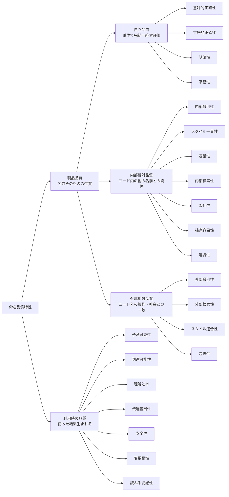

## 全体像（結論を先に）

名前のよさは、漠然とした「センス」ではなく、いくつもの観点に分けて整理できる。本記事ではそれを **命名品質特性** と呼び、ソフトウェア品質特性に倣って **3 つの軸** と **22 の性質** に整理する。22 の内訳は、3 つの軸で分類する **15**（名前そのものの品質）＋ 使った結果として現れる「利用時の品質」**7** だ。

まず全体像から示す。



表にすると次のとおり。

| 大分類       | サブ特性       | 何を見るか                   | 例                                       |
| ------------ | -------------- | ---------------------------- | ---------------------------------------- |
| 自立品質     | 意味的正確性   | 事実・意味と合っているか     | `accountList` が本当に List か           |
| 自立品質     | 言語的正確性   | 綴り・文法が正しいか         | 関数は動詞句、真偽値は `is`/`has`        |
| 自立品質     | 明確性         | 意図・使い方が分かるか       | `getThreeMonthsLater` → `getExpiredDate` |
| 自立品質     | 平易性         | 速く正しく読めるか           | `genymdhms` は読めない                   |
| 内部相対品質 | 内部識別性     | 語彙で一貫＋弁別できるか     | 同概念は同名、別概念は別名               |
| 内部相対品質 | スタイル一貫性 | 形式・記法を内部で揃えるか   | 定数は `UPPER_SNAKE` で統一              |
| 内部相対品質 | 適量性         | スコープに対し過不足ないか   | 広いスコープほど具体的に                 |
| 内部相対品質 | 内部検索性     | grep で一意に当たるか        | `id` より `userId`                       |
| 内部相対品質 | 整列性         | 一覧で関連が固まるか         | `ButtonPrimary`/`ButtonSecondary`        |
| 内部相対品質 | 補完容易性     | IDE 補完で扱いやすいか       | 共通プレフィックスで候補がまとまる       |
| 内部相対品質 | 連続性         | 過去の名前と一致し続けるか   | 公開 API 名を不用意に変えない            |
| 外部相対品質 | 外部識別性     | 外の語彙と一貫＋弁別できるか | ドメイン用語・パターン語彙に合わせる     |
| 外部相対品質 | 外部検索性     | Web 検索で見つかるか         | 一般語すぎると埋もれる（Go→golang）      |
| 外部相対品質 | スタイル適合性 | エコシステムの流儀に合うか   | React の `onClick`/`handleClick`         |
| 外部相対品質 | 包摂性         | 社会・文化に配慮しているか   | `allowlist`/`denylist`                   |
| 利用時の品質 | 予測可能性     | 名前の意味を正しく当てられるか | 一貫・規約から次が読める                 |
| 利用時の品質 | 到達可能性     | 必要な人が名前にたどり着けるか | 既存 util の再利用・ライブラリ採用       |
| 利用時の品質 | 理解効率       | 速く・楽に読み解けるか       | 短く一貫した名前ほど速い                 |
| 利用時の品質 | 伝達容易性     | 会話・AI 指示で指し示しやすいか | 一語で正確に指せる                     |
| 利用時の品質 | 安全性         | 誤用・バグを防げるか         | `deleteAt`/`deletedAt` を取り違えない    |
| 利用時の品質 | 変更耐性       | 将来も名前を変えずに済むか   | 実装でなく意図で名付ける                 |
| 利用時の品質 | 読み手網羅性   | 人・AI・新規参加者に通じるか | 誰が読んでも分かる                       |

以降は、この地図をどう読むか ── とりわけ **何と照らして名前を評価するか** という主軸と、特性どうしの **トレードオフ** を説明していく。

## はじめに

普段コードを書くとき、名前にはかなりこだわっている。変数・関数・型・ファイル ── 名前はソフトウェアの内部品質、つまり可読性や保守性に直接効くからだ。良い名前はコードを読む速度を上げ、悪い名前は読むたびに小さな負債を積む。

ただ、あるとき気づいた。「可読性のために良い名前を」と一言で言うけれど、実際に名前を選ぶとき、自分は無意識に **いくつもの観点** を使い分けている。事実と合っているか、意図が伝わるか、他の名前と紛れないか、チームの慣習に沿うか……。これらは全部「可読性」と呼ばれがちだが、中身はかなり違う。

そこで、その観点を一度きちんと整理したくなった。そして整理してみて分かったのは、**観点に名前を付けると、その存在を認識できるようになる** ということだ。「ここはなんとなく読みにくい」ではなく「ここは _明確性_ は高いが _適量性_ が低い」と言えれば、レビューでも自分の頭の中でも、議論の解像度が上がる。これは命名そのものの効用でもある。

参考にしたのは **ソフトウェア品質特性**（ISO/IEC 25010 など）だ。ソフトウェアの「良さ」を機能適合性・保守性・性能効率性……と分類するあの枠組みである。それに倣って、名前の良さの観点を分類したものを、本記事では **命名品質特性** と呼ぶことにする。

ここで示す分類基準・用語はこの記事独自のものです。
分類・用語には議論の余地があると思います。

### この記事が対象とする名前

本記事が主に対象とするのは、開発者が名付ける **プログラム・コードの名前** だ。

- 変数名・関数名
- ディレクトリ名・ファイル名
- リポジトリ名
- API（エンドポイント・パラメータなど）の名前

いずれも「開発者が読み書きするコード」上の名前である。

ただし、ここで挙げる観点の多くは、発展的に UI 上の命名（ボタンラベルなど）、 **サービス名・プロダクト名** 、記事タイトルの命名にも応用できる。とくに外部相対品質や連続性は、公開され広く知られる名前ほど強く効いてくる。

ただしサービス名・プロダクト名は、名前が *識別子として* 良く働くか（本記事が扱う品質）に加えて、**魅力・好印象・コピーライティング、商標やドメインの取得可否** といった「名前で売る・惹きつける」別ドメインの関心も背負う。後者は命名 *品質* とは別軸なので本記事では扱わない（たとえば「検索で見つかるか＝外部検索性」は品質側だが、「覚えやすく好印象か」はコピーライティングの領域）。

なお、筆者はウェブ開発者なので、例は JavaScript・TypeScript・React に偏る。ただし **命名品質特性の概念自体は特定の言語に依存しない**。どの言語の命名にも通用する考え方で、言語やエコシステムによって変わるのは具体的な綴りの規約（ケースの流儀や接頭辞など）だけだ。

### なぜ今、命名なのか

命名はソフトウェア開発で昔から重要だった。が、近年その必要性はさらに増している。**AI というテキスト処理を中心とするツール** が開発に入ってきたからだ。

- 名前が曖昧だと、AI に意図を補足するためのコンテキスト（説明）が増える。**単体のワードで意図が伝わる名前** は、それだけでコンテキストを節約する。
- これまで「個人開発で、他人とコードを共有しないなら可読性は二の次」という割り切りもあり得た。だが AI と共同で書くなら、**AI に伝わること** がそのまま開発体験に効く。

コードの読み手は、もはや人間だけではない。人にも AI にも伝わる名前を、という視点が加わったのが今である。

## この記事で対象としないこと

本記事は「コードの名前を **どう良くするか**」に集中する。その手前にある隣接した話を 2 つ、対象外として先に切り分けておく。

ひとつは **「何に名付けるか」**。マジックナンバーや複雑な条件式、概念の塊を、どこで切り出して名前付きの単位にするか、という問いだ。これは抽象化・リファクタリングの領域で、名前の良し悪し以前の話になる。なお、**名付けにくさは設計のサイン** でもある（この点はおわりにで触れる）。本記事は「切り出した対象に、どう良い名前を付けるか」に絞る。

もうひとつは **Layer 0（床）**。言語仕様上 valid な識別子であること（コンパイルが通る）、さらに「動く風だが挙動が変わる」もの ── 予約語、React コンポーネントの大文字始まり（小文字だと DOM 要素扱いになる）など ── は、品質以前の **前提** だ。良し悪しを選ぶ余地がなく、守らないと動かない。これらは「品質」ではないので扱わない。

## 主軸：名前を「何と照らして」評価するか

命名品質特性の背骨は **「名前のよさを、何と照らし合わせて判断するか」** だ。これで大きく 3 つに分かれる。

- **自立品質** ── 名前とその対象だけで評価が完結する（絶対評価）。他の名前を見に行かなくてよい。
- **内部相対品質** ── コード内の **他の名前・スコープ・過去の自分** との関係で決まる。
- **外部相対品質** ── コードの外にある **規約・慣習・社会** との一致で決まる。

「絶対評価か相対評価か」、相対なら「内（自分のコード）か外（社会）か」。この一本の軸で全体が並ぶ。

なお **何を前提に固定するかで、この境界は動く**。たとえば「英語」や「React」を前提に固定すれば、本来は外部との一致だった観点も、固定ルールに従うだけの自立評価に近づく。この点はトレードオフの節で改めて触れる。

## 自立品質 (standalone quality)

名前とその対象、そして固定した前提（使う言語や読者層）だけで判断できる品質。

:::message
以降のコード例で **🪫 は「その観点（〇〇性）が低い」、🔋 は「高い」** を表す。✅／❌ のような絶対的な正解・不正解ではない。同じ名前でも観点ごとに高低は変わり、総合的な良し悪しは文脈（影響範囲や固定した前提）で決まる。
:::

### 意味的正確性 (semantic accuracy)

非常に基本的な項目です。名前が **指示対象（実体）と意味的に合っている** かの基準です（綴り・文法の正しさは後述の言語的正確性で扱う）。

- 名前が指す対象の **事実** と合っているか
- 型と名前が矛盾しない

特に避けたいのは「嘘をつく名前」である。`accountList` が実際には List 型でないとき、これは「情報がない名前」よりたちが悪い。読み手を積極的に誤解させるからだ。

```ts
// 🪫 低: 内容と合っていない
function getName() {
  return user.age;
}
// 🪫 低: 型と合っていない
const userCountString = 10;

// 🔋 高
function getAge() {
  return user.age;
}
const userCountNumber = 10;
```

こういった命名をあえてしようと思う人はいないでしょうが、すでにあるコードを変更したときに、実装を変えたが命名を変え忘れたりすると名前と中身が乖離することはよくあります。

### 言語的正確性 (linguistic correctness)

名前が **自然言語として正しい** か。意味的正確性が「指示対象と意味が合っているか」だったのに対し、こちらは語そのものの形式が正しいかを見る。意味系と形式系で対をなす観点だ。英語と、使う言語・フレームワークを前提に判断する。中身は 2 つの面に分かれる。

- **綴り（orthography）**：語が正しく綴られているか（`recieve` ではなく `receive`）。
- **文法（grammar）**：関数・メソッドは動詞句、変数・クラスは名詞句、コレクションは複数形、真偽値は `is`/`has`/`can`、否定形は避けて肯定を基準に。`user.hasPermission()` が自然な英文として読めるか。

（言語学では、表現が文法ルール上正しいことを「適格性（well-formedness）／文法性（grammaticality）」と呼ぶ。これは上記の **文法** の面に対応する語で、**綴り** は含まない。両方を覆うため、ここでは「言語的正確性」と呼ぶ。）

```ts
// 🪫 低: スペルミス（語として整っていない）
const booolean = true;
const recieve = getMessage();
// 🔋 高
const boolean = true;
const receive = getMessage();
```

```
// 🪫 低: ブール値ならば is、を意識すぎて英語がおかしい
const isShowButton = true;
// 🔋 高: 
const shouldShowButton = true;
const isButtonShown = true;
```

```
// 🪫 低: ブール値ならば is、を意識すぎて英語がおかしい
isCanEdit
// 🔋 高: 
isEditable
canEdit
```


```ts
// 🪫 低: 関数なのに名詞／真偽値なのに否定形
function userName() {}
const notReady = false;
// 🔋 高: 関数は動詞句、真偽値は is + 肯定形
function getUserName() {}
const isReady = true;
```

逆に、**データ（名詞）なのに動詞句**で名付けると関数に見える。送信予定のメッセージを `sendMessage` とすると「メッセージを送る動作」に読めてしまう。データなら名詞句で `messageToSend`（あるいは `outgoingMessage`）とする。`userName`（関数なのに名詞）とちょうど逆向きの取り違えで、英語を母語としない開発者がやりがちだ。

```ts
// 🪫 低: 送信予定のデータ（名詞）なのに動詞句で、関数に見える
const sendMessage = { to, body };
// 🔋 高: データは名詞句で
const messageToSend = { to, body };
```

### 明確性 (clarity)

名前だけで **意図・使い方** が分かるか。

- 具体性があること。抽象的な名前は、読み手が「何をするのか」を推測する余地を残す。
- 「どのように（実装）」ではなく「何のために（目的）」で名付けることだ。

```ts
// 🪫 低: 抽象すぎる
getDate();
// 🪫 低: 「3か月後を取得」= 実装の説明
getThreeMonthsLater();
// 🔋 高: 「有効期限を取得」= 目的
getExpiredDate();
```

連番のように **中身を語らない名前** も明確性が低い。`img1`/`img2` は区別こそつくが「どの画像か」は分からない。意味で名付ければ、名前だけで中身が分かる（共通の接頭辞を残せば補完や検索でも探しやすい）。

```ts
// 🪫 低: 連番。中身が分からない
const img1 = loadImage();
const img2 = loadImage();
// 🔋 高: 中身を名前で語る
const imgCircle = loadImage();
const imgCross = loadImage();
```

実装の詳細（型やデータ構造）を名前に埋め込まないこと、呼び出す側が欲しいもので名付けること（クライアント視点）も、すべてここに含まれる。

また、**使うときの注意（副作用・リスク）も名前で伝える**と、誤用を未然に防げる。React の `dangerouslySetInnerHTML` は、名前にあえて「危険」と書くことで「サニタイズせず使うと XSS になる」と警告し、軽率な使用を思いとどまらせる。`unsafe`・`UNSAFE_`・`unstable_` なども同類だ。この“警告的命名”は、後述の利用時の品質「安全性」に直結する。

### 平易性 (simplicity)

人が **速く正しく** 読めるか。

- 文字数が短いこと
- 平易な語であること（辞書を引かずに分かる）
- 読み上げられること（`genymdhms` は会話やレビューで困る）
- 字形が紛れないこと（`l`/`1`/`I`）
- 理解できる言語（これは英語や日本語などの自然言語のこと）で表現されていること

```ts
// 🪫 低: 母音が抜けて読めない・発音できない
const genymdhms = generateTimestamp();
// 🔋 高
const timestamp = generateTimestamp();
```

```text
// 🪫 低: 区切りがわかりにくい
contenteditable
// 🔋 高
content-editable
```

:::message

`contenteditable` は実際に存在する HTML のグローバル属性のひとつです。
https://developer.mozilla.org/ja/docs/Web/HTML/Reference/Global_attributes/contenteditable
HTML の属性名の仕様上、区切り文字もなくすべて小文字で連結されています。仕様上しかたないのですが、読みにくい。
初見で「contented/itable」と読んでしまい、content の過去形ってなんやねんと思ってしまいました。
個人的読みにくいワードランキングの上位です

:::

なお「平易さ」は **固定した読者層** に対して判定する。読み手が日本語話者なら、Storybook の Story 名を日本語にするのも平易性のうちだ。

番号より **なじみのある固有名** のほうが覚えやすく口にしやすい、ということもある。台風のアジア名（「ダムレイ」など）が番号でなく名前なのは、気象庁いわく「なじみのある呼び名で防災意識を高める」「アジア各地域の文化を尊重し連帯を強める」ためだ ── なじみ＝平易性、文化への配慮＝後述の包摂性に通じる動機で、取り違えにくさ（弁別性）はむしろ副産物にすぎない。同じ固有名でも、米国のハリケーン名のように *取り違え防止* が主目的なら弁別性 ── 動機しだいで効く特性が変わる好例だ。

## 内部相対品質 (internal-relative quality)

自立品質ではその名前単体で評価できる性質を見たが、内部相対品質・外部相対品質では、他の名前と比べて評価される性質を見ていく。
同じ関数の中の他の変数名、同じファイルの中の他の関数名、同じリポジトリ内の他のファイル名……など、**あるスコープの中の相対的な関係性**で評価される品質です。

### 内部識別性 (internal identifiability)

コードの中で「これは何か」を正しく見分けられるか。これはさらに 2 つの側面に分けられる。

- **一貫性**（同じものは同じ名前）
- **弁別性**（違うものは違う名前）


#### 一貫性

同じ概念には同じ名前を使う。分析→設計→実装の層をまたいでも語を保つ。さらに、**比喩・語彙の体系を混ぜない**（郵便の比喩で組んだなら `stream`/`flush` を持ち込まない）。

```ts
// 🪫 低: 同じ「取得する」が get / fetch / load でバラバラ
getUser();
fetchOrder();
loadProduct();
// 🔋 高: 同じ概念は同じ動詞で揃える
getUser();
getOrder();
getProduct();
```

この「一貫した識別」という発想は、WCAG の達成基準 3.2.4「一貫した識別性」とも通じる（同じ機能には一貫したラベルを、という UI 側の基準で、着想として借りている）。

もう1つ、**名前の構造を要素どうしの関係に合わせる**のも一貫性だ。従属（包含）するものは従属と分かる名前に、並列なものは並列の命名規則で揃える。`List` / `ListItem` は「Item は List の子」と読めてよい。一方 `Button` / `ButtonSpecial` は、ButtonSpecial が Button の子のように見えて誤解を招く（実際は並列なバリアント）。並列なら対等に揃える。

```tsx
// 🪫 低: ButtonSpecial が Button の子要素に見える（実際は並列なバリアント）
Button;
ButtonSpecial;
// 🔋 高: 並列なものは対等な命名規則で揃える
ButtonCommon;
ButtonSpecial;
// 🔋 高: 従属（包含）は従属と分かる名前で
List;
ListItem;
```

#### 弁別性

- **弁別**：紛らわしい別物を区別する（`date` → `startDate`）。プロジェクト内の他のシンボルと衝突させない。

連番や似すぎた名前より、**互いに紛れない名前** のほうが弁別性は高い。取り違えを防ぎたいときは、あえて遠い名前を選ぶ。たとえば医薬品では、似た名前による投与ミスを避けて名称を変える対応が実際にある（日本でも降圧剤「アルマール」が糖尿病薬「アマリール」と紛らわしく、改名された）。無線で使う NATO のフォネティックアルファベット（Alpha, Bravo, Charlie…）も、`B`・`D`・`P` などを聞き間違えないよう紛れない語に置き換える同じ発想だ。ただし遠い名前は中身を語らない（明確性は上がらない）し、連番のような **整列性** も失う ── 取り違え防止（利用時の安全性）を、明確性・整列性と引き換えに買う選択になる。

なお `img1`/`img2` を *中身を記述* する `imgCircle`/`imgCross` にするのは明確性、*互いに紛れない* 名前にするのは弁別性で、同じ「連番をやめる」でも動機＝効く特性が違う。

### スタイル一貫性 (style consistency)

形式・記法の流儀を、**自分のコード内で揃えている** か。定数は `UPPER_SNAKE`、コンポーネントは `PascalCase`、ハンドラは `handle*` ── どの流儀を選ぶかは自由でも、選んだら **最後まで一貫させる**。外部標準のない独自ルールでも、一貫してさえいれば読み手はそこから手がかりを得られる。

内部識別性が **語彙** で見分ける話だったのに対し、こちらは **形式** を揃える話だ（意味系と形式系の対をなす）。たとえば定数を `UPPER_SNAKE` に統一すると、読み手は形だけで「これは定数だ」と当てられる。ただしその「当てられる」便益自体は後述の利用時の品質「予測可能性」に流れるもので、ここで見るのは *形式が揃っているか* そのものである。

```ts
// 🪫 低: 定数・コンポーネント・真偽値の記法がバラバラ
const maxCount = 100;
const max_retry = 3;
function userCard() {}
const enabled_flag = true;
// 🔋 高: カテゴリごとに記法を一貫させる
const MAX_COUNT = 100;
const MAX_RETRY = 3;
function UserCard() {}
const isEnabled = true;
```

なお「どの流儀に合わせるか」の照合先が **エコシステム標準** に向くと、後述の外部相対品質「スタイル適合性」になる。自分の中で揃えるのがスタイル一貫性、世間の流儀に合わせるのがスタイル適合性で、**一貫（対 自分）↔ 適合（対 外部）** の対をなす。

### 適量性 (proportionality)

スコープに対して情報量が **過不足ない** か。**多すぎを削る／足りなければ足す** の双方向で、どちらに倒すかは **スコープが裁定** する。この 2 方向にそれぞれ名前をつけておく。

#### 簡潔性（減らす方向）

スコープが既に与えている情報は繰り返さない。狭いスコープなら短くてよい。

```ts
// 🪫 低: user スコープ内なのに user を繰り返す（冗長）
user.userName;
user.userId;
// 🔋 高
user.name;
user.id;
```

```ts
// 🪫 低: 単なるループ変数に長い名前を与えている
for (let userArrayIndex = 0; userArrayIndex < users.length; userArrayIndex++) {
  const user = users[userArrayIndex];
}
// 🔋 高: 狭いスコープなら短く
for (let i = 0; i < users.length; i++) {
  const user = users[i];
}
```

ここでの簡潔さは *スコープに照らした* 冗長の排除であり、語そのものの平易さ（平易性）とは別だ。`userName` 単体は難しくないが、`user.` の中では冗長 ── という相対の判断になる。

#### 十分性（増やす方向）

逆に、広い・公開スコープでは、名前だけで意味が取れるよう具体を **足す**。スコープが文脈を与えてくれない分、名前が背負う。

```ts
// 🪫 低: モジュールから公開する名前が漠然としすぎ
export const data = fetchAll();
// 🔋 高: 広いスコープには十分な具体を
export const activeUsers = fetchAll();
```

### 内部検索性 (greppability)

ツールの上での話。
grep（ソースコード内での検索）で一意に当たるか。`id` のような汎用語は埋もれる。

```ts
// 🪫 低: grep すると大量にヒットして埋もれる
// user.ts
export const KEY = "KEY_FOR_USER";
// admin.ts
export const KEY = "KEY_FOR_ADMIN";

// 🔋 高: 一意に検索でき、補完でも絞り込める
export const KEY_FOR_USER = "KEY_FOR_USER";
export const KEY_FOR_ADMIN = "KEY_FOR_ADMIN";
```

静的解析で見つけることもできるが。

なお **弁別性が高いほど内部検索性も上がる**（紛れない名前は grep でも一意に当たる ── `id` は埋もれ、`KEY_FOR_USER` は当たる）。この「区別できる → 見つかる」という関係は外の世界でも同じで、そちらは後述の **外部検索性** で扱う。


```
const userId = user.id;
```


命名とは別の観点にはなるが、内部検索性を高めるには文字列連結による処理をできるだけ避けるのが望ましい。


```tsx
// icon ファイルの名前を連結して生成する
const iconType = "close";
return 
```
ここでは `icon_close.svg` ファイルが参照されることになるが、`icon_close` という名前で検索しても引っかからない。
このファイルを使っていないと判断して間違って削除してしまうかもしれない。


### 整列性 (sortability)

主にファイル名の命名で考慮。
一覧でアルファベット順に並べられたときに、有用な並び順になるか。

- 関連する名前が固まるか（`PrimaryButton` より `ButtonPrimary`、連番は `image-01` とゼロ埋め）。
- 意味のある順番に並ぶか
- 特別なものが先頭や末尾に来るか（`_` で始めるなど）

```
// 🪫 低: 数字の順に並ばない
image-1.png
image-10.png
image-2.png
...

// 🔋 高: 数字の順に並ぶ
image-01.png
image-02.png
...
image-10.png
```

最近では数字列を数値の大小でソートしてくれるシステムも増えてきてはいるが、純粋な辞書順ソートではゼロ埋めをしないと意図した順序に並ばない。

```ts
// 🪫 低: 関連する名前が離れてしまう
PrimaryButton;
SecondaryButton;
// 🔋 高: 関連する名前が固まる
ButtonPrimary;
ButtonSecondary;
```

### 補完容易性 (completion discoverability)

IDE 補完で絞り込めるか。共通プレフィックスで候補がまとまると探しやすい。

```ts
// 🪫 低: 補完で候補が散らばる
const theme = {
  red: "#f00",
  blue: "#00f",
  green: "#0f0",
  small: "8px",
  medium: "16px",
  large: "32px",
};

// 🔋 高: 共通プレフィックスで候補がまとまる
const theme = {
  colorRed: "#f00",
  colorBlue: "#00f",
  colorGreen: "#0f0",
  sizeSmall: "8px",
  sizeMedium: "16px",
  sizeLarge: "32px",
};
// → theme.color で補完すると色だけが、theme.size で補完するとサイズだけが候補に出る
```

### 連続性 (continuity, temporal consistency)

いったん広まった名前を、**過去の自分と一致** させ続けられるか。公開 API やサービス名は、昔から知っている人に伝わり続けることに価値がある。これは「内部一貫性（空間）」に対する「時間軸の一貫」だ。

master → main への変更は実は `ma` から始まる点でパッと見の印象が近いので、連続性を保った変更の例と勝手に思っている。

公開した名前ほど連続性は重く効く ── 後述の裁定基準 **影響範囲** が大きいからだ。HTTP ヘッダの `referer` が綴りミス（正しくは `referrer`）のまま保たれているのが典型で、いまさら直せば世界中の実装が壊れる。ここで「外部公開だから連続性が別の特性になる」わけではない点に注意したい。起きているのは複数の特性の合わせ技だ ── 過去の名前を保つ **連続性**、すでに外で定着した綴りに新規実装が合わせる **外部一貫性**、そして桁違いの **影響範囲**。一つの命名判断が複数の特性にまたがる好例である。


## 外部相対品質 (external-relative quality)

内部相対品質が「コードの中の他の名前との関係」で決まる品質だったのに対し、
外部相対品質は、コードベースや開発チームの外にある、規約・慣習・社会との一致で決まる品質。

### 外部識別性 (external identifiability)

外の世界の文脈で「これは何か」を正しく見分けられるか。内部識別性と同じく **一貫＋弁別** で対をなす。

- **一貫**：ドメイン用語・ユビキタス言語、世間一般の概念名、標準的な略語（`id`/`url`）、確立したパターン語彙（Factory／Validator）、慣習的な対義語ペア（`open`/`close`、`get`/`set`）に合わせる。語が世間で持つ含意にも逆らわない（`getSize()` が重い処理だと、`get`＝軽い、という期待を裏切る）。
- **弁別**：組み込み・標準ライブラリのシャドーイングを避け、商標や既存サービスとも紛れないようにする。

```ts
// 🪫 低: get は軽い処理を期待させるのに重い（世間の含意に反する）
user.getRecommendations(); // 内部で API 通信＋重い計算
// 🔋 高: 取得元・重さを示す
user.fetchRecommendations();
```

```ts
// 🪫 低: open の慣習的な相方は close（hide は別ペア show/hide のもの）
openModal();
hideModal();
// 🔋 高: 確立した対義語ペアで揃える
openModal();
closeModal();
```

### 外部検索性 (googlability)

コードの外 ── Web 検索や SNS ── で見つかるか。とくに **公開パッケージ名・リポジトリ名・公開 API・サービス名** で効く。内部検索性が grep（自分の repo）を照合先にするのに対し、こちらは **Web という空間** が照合先だ（内部識別性／外部識別性と同じ、内と外の対）。

一般的すぎる語は埋もれて検索にかからない。プログラミング言語の Go は名前が一般語すぎて探しにくく、`golang` という別名で検索される。逆に固有性の高い造語（`TypeScript`・`Kubernetes`）は一意に見つかる。**外部弁別性（外で紛れない）が高いほど外部検索性も上がる** ── 「区別 → 発見」の関係は内と同じだ。

なお、ここで扱うのはあくまで *見つかるか*（品質）であって、*覚えやすく好印象か*（コピーライティング・ブランディング）は別ドメインの話で、本記事の対象外とする。

### スタイル適合性 (style conformance)

エコシステムの **形式・スタイルの流儀** に合うか。いわゆる *idiomatic*（その言語・フレームワークで「自然」とされる書き方）に沿うことだ。動きはするが、合わせるとツールにも読み手にも親切なものだ。ファイル名の `kebab-case`、テストの `*.test.ts`、React の props は `onClick`／内部ハンドラは `handleClick`、state は `[count, setCount]` ── どれも外しても動くが、外すと毎回引っかかる。

前述のスタイル一貫性が「自分のコード内で形式を揃える」話だったのに対し、こちらはその **揃え先を世間の流儀にする** 話だ。

```tsx
// 🪫 低: 動くが React の流儀から外れる
<button onClick={clickHandler} />;
const [count, updateCount] = useState(0);
// 🔋 高: 受け口は handle*、setter は set + state 名
<button onClick={handleClick} />;
const [count, setCount] = useState(0);
```

（「動かない・必須」の規約は品質ではなく前述の Layer 0 に属する。ここは「動くが合わせると良い」流儀だけを指す。なお *idiomatic* は実装パターンやディレクトリ構成まで広く指す語だが、ここで扱うのは名前の **形式・記法** に限る。）

### 包摂性 (inclusivity)

社会・文化に配慮しているか。差別的な含意のある語を避け（`master/slave` → `primary/replica`）、他言語・文化で不適切になる語にも気を配る。

なお inclusiveness は DEI（多様性・公平性・包摂性）の文脈で **「包括性」と訳されることも多い**。本記事では「網羅性（名前が概念を漏れなく覆うこと）」と紛れないよう、排除しない意味が明確な「包摂性」を採った。

https://www.aswf.io/blog/inclusive-language/

https://www.publickey1.jp/blog/20/twitterwhitelistblacklistmasterslavedummy_value.html

https://zenn.dev/ait/articles/5ad7053daa6ffd

https://ja.wikipedia.org/wiki/%E7%A4%BE%E4%BC%9A%E7%9A%84%E5%8C%85%E6%91%82

代表例：

| 不適切な語 | 推奨される語 |
| ----------- | ------------ |
| master       | main      |
| master / slave | primary / replica |
| master / slave | primary / secondary |
| master / slave | leader / follower |
| white list / black list | allow list / block list, deny list |
| dummy（変数・データ） | placeholder |


https://gist.github.com/mattn/488af4c3b3841ea901a1f9820636393c

inclusive language と言われます。

Google のドキュメントでも、 inclusive documentation のガイドラインが公開されています。

https://developers.google.com/style/inclusive-documentation

JavaScript の ESLint ルールとしても、包摂性をチェックするプラグインが存在。
（自分も今回記事を作る中で調査していて知ったのですが）
README にはインクルーシブな言葉遣いとは？の説明から始まり「ESLint プラグインが必要なのですか？」「おそらく必要ないでしょう」という内容があり、厳密にチェックしたいというよりも、この問題について認知度を上げることが目的のようです。

https://github.com/muenzpraeger/eslint-plugin-inclusive-language

## 利用時の品質：名前を使った結果

ここまでの 3 大分類は **名前そのものの性質**（製品品質）だった。ISO/IEC 25010 が製品品質とは別に「利用時の品質」（使った結果として現れる品質）を分けているように、命名にも **使った結果として生まれる品質** がある。これらは複数の特性が寄与して生まれるため、特定の大分類には属さない。

ISO の利用時の品質（有効性・効率性・リスク回避性・利用状況網羅性）になぞらえると、命名のアウトカムは 7 つに整理できる。

- **予測可能性 (predictability)**（有効性）── 読み手が「この名前はこういう意味だろう」と *正しく* 当てられること。内部識別性・外部識別性・スタイル一貫性・スタイル適合性などが寄与する（定数が `UPPER_SNAKE` なら「定数だ」と当てられる、など。「誤解を招かない」はこの裏返しだ）。
- **到達可能性 (reachability)**（有効性）── 必要な人が、その名前に *たどり着ける* こと。同僚が既存のユーティリティ関数を見つけて再利用する（重複実装を防ぐ）、使ってほしいライブラリが Web 検索で見つかって採用される、など。内部検索性・外部検索性が *見つけやすさ* を、明確性・予測可能性が「これが探していたものだ」という確信を与える。検索性が *見つけられる性質* なら、到達可能性は *実際にたどり着けた結果* だ（なお「発見可能性」はデザイン分野で「どんな操作が可能か・どう操作するかを見つけられるか」という別の意味で使われるため、ここでは *到達* と呼ぶ）。
- **理解効率 (comprehension efficiency)**（効率性）── *速く・楽に* 読み解けること。短く一貫した名前ほど速い。予測可能性が「正しく分かる」なら、こちらは「速く分かる」── 別の軸であり、簡潔さと明確さのように両者は衝突することもある。
- **伝達容易性 (communicability)**（効率性）── 名前を *共有語彙* として、チームの会話・レビューや AI への指示で、正確かつ素早く指し示せること。一語で「`getExpiredDate` を直そう」と言えるか、AI に「`data` を意味のある名前に」と的確に指示できるか。発音可能性（平易性）・明確性・予測可能性・読み手網羅性が寄与する。理解効率が *黙読* の速さなら、こちらは *対話・指示* のしやすさだ ── 冒頭の「AI への指示」という動機がここに効く。
- **安全性 (safety)**（リスク回避性）── 紛らわしい名前による *誤用・バグ* を防げること。`deleteAt` と `deletedAt`、List でないのに `List` ── 取り違えやすい名前は事故を生む。逆に `dangerouslySetInnerHTML` のように名前で危険を知らせれば誤用を未然に防げる（明確性が安全性に効く例）。
- **変更耐性 (change resilience)**（リスク回避性）── 将来の変更で名前を *変えずに済む* こと。意図で名付ければ実装を変えても名前は有効だし（明確性）、スコープに見合った抽象度なら成長しても破綻しない（適量性）。
- **読み手網羅性 (reader coverage)**（利用状況網羅性）── *人・AI・新規参加者* の誰が読んでも通じること。冒頭で触れた「読み手は人間だけではない」がここに効く。

つまり、個々の特性はバラバラに存在するのではなく、**少数のアウトカムに寄与・収束** している。

## トレードオフと裁定

ここが本題かもしれない。命名品質特性は、**全部を同時には満たせない**。

これは欠陥ではなく、品質特性そのものの性質だ。ISO/IEC 25010 の品質特性も、すべてを同時に最大化するものではなく、特性間にトレードオフがある（だからこそ ATAM のようなトレードオフ分析手法が存在する）。品質モデルは「共通の語彙」を与えるだけで、優先順位は文脈が決める。命名も同じだ。

最も基本的な衝突は、**簡潔さ・平易さ（平易性）↔ 明確性** だ。

```text
d                  // 簡潔だが意味が薄い
daysSinceLastLogin // 明確だが長い
```

トレードオフな事例

```
// 「アンケート」の命名
// 日本人は「アンケート」で馴染みがあるが、これはフランス語。
// Code Spell Checker でスペルミス扱いされる（英語辞書で設定していれば）
enquete
// 英語では questionnaire。
questionnaire
```


どちらが正解かは単体では決まらない。**スコープ（適量性）が裁定する**。3 行のループ内なら `d` で十分だし、公開 API の引数なら `daysSinceLastLogin` が要る。つまり **自立品質どうしの対立を、内部相対品質が裁定する** 構図だ。

裁定の基準は主に 2 つ。

- **影響範囲**：ローカル変数のリネームは安い。が、公開 API・URL・DB カラム・JSON キーは高くつく。影響範囲が広い名前ほど、意味的正確性・一貫性・明確性の側に倒す。
- **固定した前提**：英語・フレームワーク・読者層・社会通念のうち何を固定するかで、外部相対の優先度や、自立／外部の境界そのものが動く。

### あえて崩す ── どの特性を立てるか

良い命名は、ときに **素直な名前をあえて崩す**。何を立てて何を捨てているかを見ると、特性どうしの綱引きがはっきりする。

| 素直なら | あえて | 立てる特性 | 捨てる特性 |
| --- | --- | --- | --- |
| `setHtml` | `dangerouslySetInnerHTML` | 安全性（危険を名前で警告） | 簡潔性 |
| `index`／`event` | `i`／`e` | 適量性（狭スコープは短く） | 明確性 |
| `referrer`（正しい綴り） | `referer` | 連続性（後方互換） | 言語的正確性 |
| `testInvalidEmail` | `it('shows error when …')` | 明確性・読み手網羅性 | 簡潔性 |
| `name`（同じ型） | `usName`／`sName` | 弁別性 → 安全性 | 平易性 |
| `largest` | `xl`（`s`/`m`/`l`/`xl`） | 変更耐性（拡張余地） | ― |

たとえば React の `dangerouslySetInnerHTML` は、素直なら `setHtml` で済むところを、あえて長く物々しくして **安全性**（誤用への警告）を最優先した名前だ。HTTP ヘッダの `referer` にいたっては、正しい綴り `referrer` を知りながら、いったん広まった綴りを変えないために **連続性**（後方互換）を取り、**言語的正確性** を捨てている。

共通するのは、**「全特性を満たす名前」ではなく「この文脈で勝たせる特性を選んだ名前」が良い名前** だということ。どれを勝たせるかを決めるのが、まさに前述の裁定だ。

## おわりに：命名は設計へのフィードバック

最後に、分類から少し離れた話をひとつ。

**良い名前が付けにくいとき、それは設計のサインである** ことが多い。`DoStuff` のような名前しか浮かばないのは、その対象が多くの責務を抱えていて、一語で言い表せないからだ。名前を付けようとする行為が、「ここは分けるべきだ」「これは別のものとまとめるべきだ」という設計上の気づきを連れてくる。

実は、この記事の分類を作る過程でも同じことが起きた。観点に名前を付けようとすると、似た観点が統合され（検索のしやすさと整列のしやすさは別物だと分かれ）、抜けていた観点が見つかり（「過去の名前との連続性」に名前が付いて初めてその存在に気づいた）、構造が整っていった。

**名前は、対象の理解を駆動する**。だから命名にこだわることは、コードを読みやすくするだけでなく、設計そのものを良くすることにつながる。良い名前を付けようとする時間は、けっして無駄ではない。
