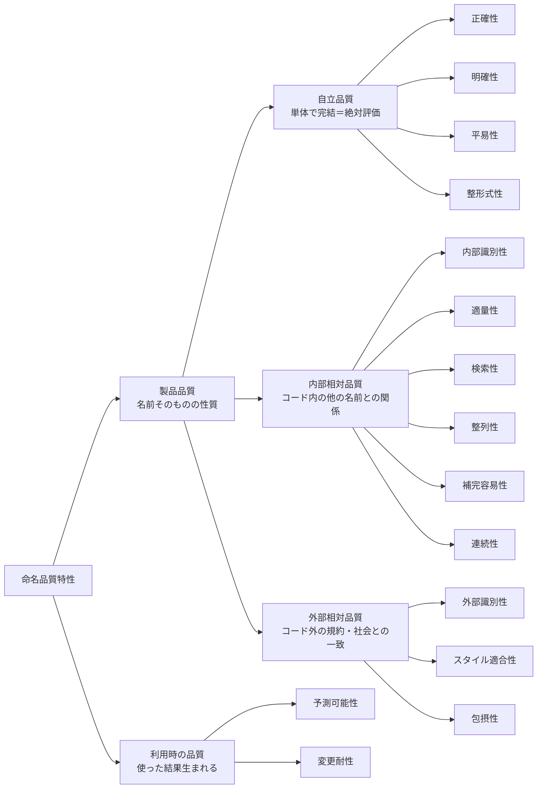

## 全体像（結論を先に）

名前のよさは、漠然とした「センス」ではなく、いくつもの観点に分けて整理できる。本記事ではそれを **命名品質特性** と呼び、ソフトウェア品質特性に倣って分類する。

まず全体像から示す。



表にすると次のとおり。

| 大分類 | サブ特性 | 何を見るか | 例 |
|---|---|---|---|
| 自立品質 | 正確性 | 事実と合っているか | `accountList` が本当に List か |
| 自立品質 | 明確性 | 意図・使い方が分かるか | `getThreeMonthsLater` → `getExpiredDate` |
| 自立品質 | 平易性 | 速く正しく読めるか | `genymdhms` は読めない |
| 自立品質 | 整形式性 | 文法・形式が正しいか | 関数は動詞句、真偽値は `is`/`has` |
| 内部相対品質 | 内部識別性 | 一貫＋弁別で見分けられるか | 同概念は同名、別概念は別名 |
| 内部相対品質 | 適量性 | スコープに対し過不足ないか | 広いスコープほど具体的に |
| 内部相対品質 | 検索性 | grep で一意に当たるか | `id` より `userId` |
| 内部相対品質 | 整列性 | 一覧で関連が固まるか | `ButtonPrimary`/`ButtonSecondary` |
| 内部相対品質 | 補完容易性 | IDE 補完で扱いやすいか | 共通プレフィックスで候補がまとまる |
| 内部相対品質 | 連続性 | 過去の名前と一致し続けるか | 公開 API 名を不用意に変えない |
| 外部相対品質 | 外部識別性 | 外の語彙と一貫＋弁別できるか | ドメイン用語・パターン語彙に合わせる |
| 外部相対品質 | スタイル適合性 | エコシステムの流儀に合うか | React の `onClick`/`handleClick` |
| 外部相対品質 | 包摂性 | 社会・文化に配慮しているか | `allowlist`/`denylist` |
| 利用時の品質 | 予測可能性 | 名前の意味を当てられるか | 一貫・規約から次が読める |
| 利用時の品質 | 変更耐性 | 将来も名前を変えずに済むか | 実装でなく意図で名付ける |

以降は、この地図をどう読むか ── とりわけ **何と照らして名前を評価するか** という主軸と、特性どうしの **トレードオフ** を説明していく。

## はじめに

普段コードを書くとき、名前にはかなりこだわっている。変数・関数・型・ファイル ── 名前はソフトウェアの内部品質、つまり可読性や保守性に直接効くからだ。良い名前はコードを読む速度を上げ、悪い名前は読むたびに小さな負債を積む。

ただ、あるとき気づいた。「可読性のために良い名前を」と一言で言うけれど、実際に名前を選ぶとき、自分は無意識に **いくつもの観点** を使い分けている。事実と合っているか、意図が伝わるか、他の名前と紛れないか、チームの慣習に沿うか……。これらは全部「可読性」と呼ばれがちだが、中身はかなり違う。

そこで、その観点を一度きちんと整理したくなった。そして整理してみて分かったのは、**観点に名前を付けると、その存在を認識できるようになる** ということだ。「ここはなんとなく読みにくい」ではなく「ここは *明確性* は高いが *適量性* が低い」と言えれば、レビューでも自分の頭の中でも、議論の解像度が上がる。これは命名そのものの効用でもある。

参考にしたのは **ソフトウェア品質特性**（ISO/IEC 25010 など）だ。ソフトウェアの「良さ」を機能適合性・保守性・性能効率性……と分類するあの枠組みである。それに倣って、名前の良さの観点を分類したものを、本記事では **命名品質特性** と呼ぶことにする。

### この記事が対象とする名前

本記事が主に対象とするのは、開発者が名付ける **プログラム・コードの名前** だ。

- 変数名・関数名
- ディレクトリ名・ファイル名
- リポジトリ名
- API（エンドポイント・パラメータなど）の名前

いずれも「開発者が読み書きするコード」上の名前である。

ただし、ここで挙げる観点の多くは、発展的に **サービス名・プロダクト名** の命名にも応用できる。とくに外部相対品質や連続性は、公開され広く知られる名前ほど強く効いてくる。

なお、筆者はウェブ開発者なので、例は JavaScript・TypeScript・React に偏る。ただし **命名品質特性の概念自体は特定の言語に依存しない**。どの言語の命名にも通用する考え方で、言語やエコシステムによって変わるのは具体的な綴りの規約（ケースの流儀や接頭辞など）だけだ。

### なぜ今、命名なのか

命名はソフトウェア開発で昔から重要だった。が、近年その必要性はさらに増している。**AI というテキスト処理を中心とするツール** が開発に入ってきたからだ。

- 名前が曖昧だと、AI に意図を補足するためのコンテキスト（説明）が増える。**単体のワードで意図が伝わる名前** は、それだけでコンテキストを節約する。
- これまで「個人開発で、他人とコードを共有しないなら可読性は二の次」という割り切りもあり得た。だが AI と共同で書くなら、**AI に伝わること** がそのまま開発体験に効く。

コードの読み手は、もはや人間だけではない。人にも AI にも伝わる名前を、という視点が加わったのが今である。

## この記事で対象としないこと

本記事は「コードの名前を **どう良くするか**」に集中する。その手前にある隣接した話を 2 つ、対象外として先に切り分けておく。

ひとつは **「何に名付けるか」**。マジックナンバーや複雑な条件式、概念の塊を、どこで切り出して名前付きの単位にするか、という問いだ。これは抽象化・リファクタリングの領域で、名前の良し悪し以前の話になる。なお、**名付けにくさは設計のサイン** でもある（この点はおわりにで触れる）。本記事は「切り出した対象に、どう良い名前を付けるか」に絞る。

もうひとつは **Layer 0（床）**。言語仕様上 valid な識別子であること（コンパイルが通る）、さらに「動く風だが挙動が変わる」もの ── 予約語、React コンポーネントの大文字始まり（小文字だと DOM 要素扱いになる）など ── は、品質以前の **前提** だ。良し悪しを選ぶ余地がなく、守らないと動かない。これらは「品質」ではないので扱わない。

## 主軸：名前を「何と照らして」評価するか

命名品質特性の背骨は **「名前のよさを、何と照らし合わせて判断するか」** だ。これで大きく 3 つに分かれる。

- **自立品質** ── 名前とその対象だけで評価が完結する（絶対評価）。他の名前を見に行かなくてよい。
- **内部相対品質** ── コード内の **他の名前・スコープ・過去の自分** との関係で決まる。
- **外部相対品質** ── コードの外にある **規約・慣習・社会** との一致で決まる。

「絶対評価か相対評価か」、相対なら「内（自分のコード）か外（社会）か」。この一本の軸で全体が並ぶ。

なお **何を前提に固定するかで、この境界は動く**。たとえば「英語」や「React」を前提に固定すれば、本来は外部との一致だった観点も、固定ルールに従うだけの自立評価に近づく。この点はトレードオフの節で改めて触れる。

## 自立品質

名前とその対象、そして固定した前提（使う言語や読者層）だけで判断できる品質。

### 正確性

名前が指す対象の **事実** と合っているか。型と名前が矛盾しない、スペルミスがない、といった基本だ。

特に避けたいのは「嘘をつく名前」である。`accountList` が実際には List 型でないとき、これは「情報がない名前」よりたちが悪い。読み手を積極的に誤解させるからだ。

```ts
// ❌ NG: List ではないのに List と名乗る（嘘をつく名前）
const accountList: Set<Account> = new Set();
// ✅ OK
const accounts: Set<Account> = new Set();
```

### 明確性

名前だけで **意図・使い方** が分かるか。鍵は「どのように（実装）」ではなく「何のために（目的）」で名付けることだ。

```ts
// ❌ NG: 「3か月後を取得」= 実装の説明
getThreeMonthsLater();
// ✅ OK: 「有効期限を取得」= 目的
getExpiredDate();
```

実装の詳細（型やデータ構造）を名前に埋め込まないこと、呼び出す側が欲しいもので名付けること（クライアント視点）も、すべてここに含まれる。

### 平易性

人が **速く正しく** 読めるか。短く、平易な語を使い（辞書を引かずに分かる）、口に出せて（`genymdhms` は会話やレビューで困る）、字形が紛れない（`l`/`1`/`I`）こと。

```ts
// ❌ NG: 母音が抜けて読めない・発音できない
const genymdhms = generateTimestamp();
// ✅ OK
const timestamp = generateTimestamp();
```

なお「平易さ」は **固定した読者層** に対して判定する。読み手が日本語話者なら、Storybook の Story 名を日本語にするのも平易性のうちだ。

### 整形式性

英語と、使う言語・フレームワークを前提に、**文法・形式** が正しいか。関数・メソッドは動詞句、変数・クラスは名詞句。コレクションは複数形。真偽値は `is`/`has`/`can`。否定形は避けて肯定を基準に。`user.hasPermission()` が自然な英文として読めるか、といった観点だ。

```ts
// ❌ NG: 関数なのに名詞／真偽値なのに否定形
function userName() {}
const notReady = false;
// ✅ OK: 関数は動詞句、真偽値は is + 肯定形
function getUserName() {}
const isReady = true;
```

## 内部相対品質

このコードベースの中の、他の名前・スコープ・過去との関係で決まる品質。

### 内部識別性

コードの中で「これは何か」を正しく見分けられるか。これは **一貫**（同じものは同じ名前）と **弁別**（違うものは違う名前）の両輪で成り立つ。

- **一貫**：同じ概念には同じ名前を使う。対義語のペアを混ぜない（`open`/`close`）。分析→設計→実装の層をまたいでも語を保つ。さらに、**比喩・語彙の体系を混ぜない**（郵便の比喩で組んだなら `stream`/`flush` を持ち込まない）。
- **弁別**：紛らわしい別物を区別する（`date` → `startDate`）。プロジェクト内の他のシンボルと衝突させない。

```ts
// ❌ NG: 同じ「取得する」が get / fetch / load でバラバラ
getUser();
fetchOrder();
loadProduct();
// ✅ OK: 同じ概念は同じ動詞で揃える
getUser();
getOrder();
getProduct();
```

この「一貫した識別」という発想は、WCAG の達成基準 3.2.4「一貫した識別性」とも通じる（同じ機能には一貫したラベルを、という UI 側の基準で、着想として借りている）。

### 適量性

スコープに対して情報量が **過不足ない** か。狭いスコープなら短く抽象的でよく、広いスコープほど具体的にする。スコープが既に与える情報は繰り返さない（`user.userName` → `user.name`）。多すぎを削り、足りなければ足す、の双方向だ。

```ts
// ❌ NG: user スコープ内なのに user を繰り返す（冗長）
user.userName;
user.userId;
// ✅ OK
user.name;
user.id;
```

### 検索性・整列性・補完容易性

ツールの上で名前を扱いやすいか。隣接するが、それぞれ別の概念だ。

- **検索性**：grep で一意に当たるか。`id` のような汎用語は埋もれる。
- **整列性**：一覧で関連する名前が固まるか（`PrimaryButton` より `ButtonPrimary`、連番は `image-01` とゼロ埋め）。
- **補完容易性**：IDE 補完で絞り込めるか。共通プレフィックスで候補がまとまると探しやすい。

```ts
// ❌ NG: grep すると大量にヒットして埋もれる
const id = user.id;
// ✅ OK: 一意に検索でき、補完でも絞り込める
const userId = user.id;
```

### 連続性

いったん広まった名前を、**過去の自分と一致** させ続けられるか。公開 API やサービス名は、昔から知っている人に伝わり続けることに価値がある。これは「内部一貫性（空間）」に対する「時間軸の一貫」だ。

## 外部相対品質

コードベースの外にある、規約・慣習・社会との一致で決まる品質。

### 外部識別性

外の世界の文脈で「これは何か」を正しく見分けられるか。内部識別性と同じく **一貫＋弁別** で対をなす。

- **一貫**：ドメイン用語・ユビキタス言語、世間一般の概念名、標準的な略語（`id`/`url`）、確立したパターン語彙（Factory／Validator）に合わせる。語が世間で持つ含意にも逆らわない（`getSize()` が重い処理だと、`get`＝軽い、という期待を裏切る）。
- **弁別**：組み込み・標準ライブラリのシャドーイングを避け、商標や既存サービスとも紛れないようにする。

```ts
// ❌ NG: get は軽い処理を期待させるのに重い（世間の含意に反する）
user.getRecommendations(); // 内部で API 通信＋重い計算
// ✅ OK: 取得元・重さを示す
user.fetchRecommendations();
```

### スタイル適合性

エコシステムの **形式・スタイルの流儀** に合うか。動きはするが、合わせるとツールにも読み手にも親切なものだ。ファイル名の `kebab-case`、テストの `*.test.ts`、React の props は `onClick`／内部ハンドラは `handleClick`、state は `[count, setCount]` ── どれも外しても動くが、外すと毎回引っかかる。

```tsx
// ❌ NG: 動くが React の流儀から外れる
<button onClick={clickHandler} />;
const [count, updateCount] = useState(0);
// ✅ OK: 受け口は handle*、setter は set + state 名
<button onClick={handleClick} />;
const [count, setCount] = useState(0);
```

（「動かない・必須」の規約は品質ではなく前述の Layer 0 に属する。ここは「動くが合わせると良い」流儀だけを指す。）

### 包摂性

社会・文化に配慮しているか。差別的な含意のある語を避け（`master/slave` → `primary/replica`）、他言語・文化で不適切になる語にも気を配る。

```ts
// ❌ NG
const masterNode = nodes[0];
const slaveNodes = nodes.slice(1);
const whitelist = ["example.com"];
// ✅ OK
const primaryNode = nodes[0];
const replicaNodes = nodes.slice(1);
const allowlist = ["example.com"];
```

## 利用時の品質：予測可能性と変更耐性

ここまでの 3 大分類は **名前そのものの性質**（製品品質）だった。ISO/IEC 25010 が製品品質とは別に「利用時の品質」（使った結果として現れる品質）を分けているように、命名にも **使った結果として生まれる品質** がある。これらは複数の特性が寄与して生まれるため、特定の大分類には属さない。

- **予測可能性** ── 読み手が「この名前はこういう意味だろう」と正しく当てられること。内部一貫性・外部一貫性・スタイル適合性などが寄与して生まれる（「誤解を招かない」はこの裏返しだ）。
- **変更耐性** ── 将来の変更で名前を変えずに済むこと。意図で名付ければ実装を変えても名前は有効だし（明確性）、スコープに見合った抽象度なら成長しても破綻しない（適量性）。

つまり、個々の特性はバラバラに存在するのではなく、**少数のアウトカムに寄与・収束** している。

## トレードオフと裁定

ここが本題かもしれない。命名品質特性は、**全部を同時には満たせない**。

これは欠陥ではなく、品質特性そのものの性質だ。ISO/IEC 25010 の品質特性も、すべてを同時に最大化するものではなく、特性間にトレードオフがある（だからこそ ATAM のようなトレードオフ分析手法が存在する）。品質モデルは「共通の語彙」を与えるだけで、優先順位は文脈が決める。命名も同じだ。

最も基本的な衝突は、**簡潔さ・平易さ（平易性）↔ 明確性** だ。

```text
d                  // 簡潔だが意味が薄い
daysSinceLastLogin // 明確だが長い
```

どちらが正解かは単体では決まらない。**スコープ（適量性）が裁定する**。3 行のループ内なら `d` で十分だし、公開 API の引数なら `daysSinceLastLogin` が要る。つまり **自立品質どうしの対立を、内部相対品質が裁定する** 構図だ。

裁定の基準は主に 2 つ。

- **影響範囲**：ローカル変数のリネームは安い。が、公開 API・URL・DB カラム・JSON キーは高くつく。影響範囲が広い名前ほど、正確性・一貫性・明確性の側に倒す。
- **固定した前提**：英語・フレームワーク・読者層・社会通念のうち何を固定するかで、外部相対の優先度や、自立／外部の境界そのものが動く。

## おわりに：命名は設計へのフィードバック

最後に、分類から少し離れた話をひとつ。

**良い名前が付けにくいとき、それは設計のサインである** ことが多い。`DoStuff` のような名前しか浮かばないのは、その対象が多くの責務を抱えていて、一語で言い表せないからだ。名前を付けようとする行為が、「ここは分けるべきだ」「これは別のものとまとめるべきだ」という設計上の気づきを連れてくる。

実は、この記事の分類を作る過程でも同じことが起きた。観点に名前を付けようとすると、似た観点が統合され（検索のしやすさと整列のしやすさは別物だと分かれ）、抜けていた観点が見つかり（「過去の名前との連続性」に名前が付いて初めてその存在に気づいた）、構造が整っていった。

**名前は、対象の理解を駆動する**。だから命名にこだわることは、コードを読みやすくするだけでなく、設計そのものを良くすることにつながる。良い名前を付けようとする時間は、けっして無駄ではない。
